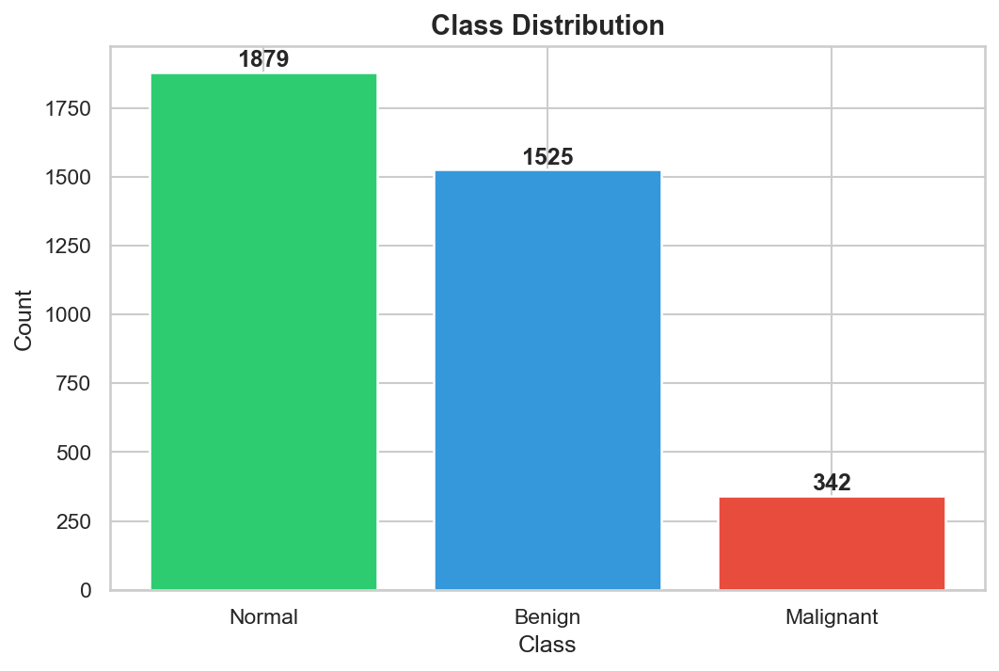
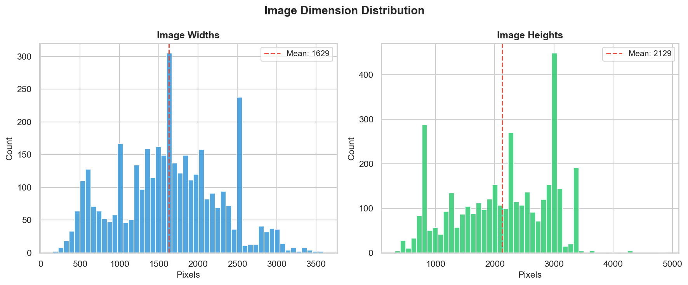
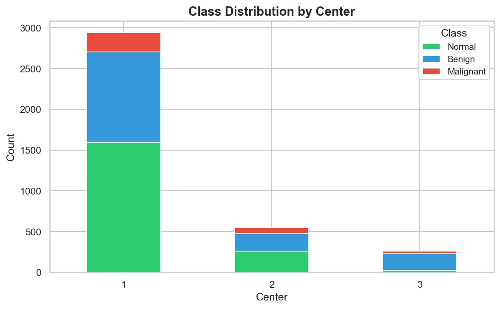
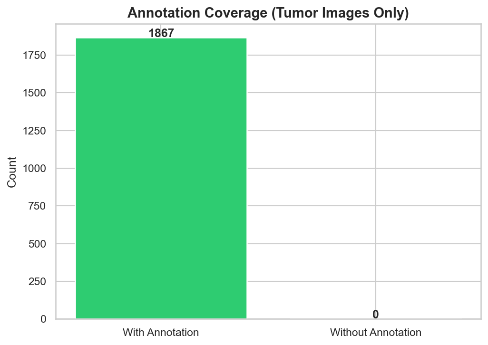
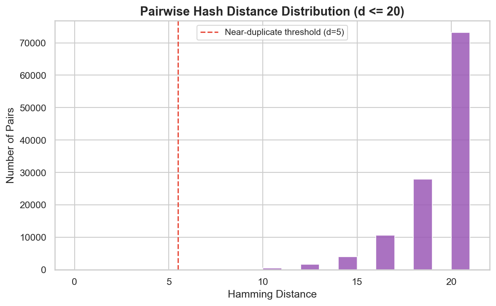

# BTXRD Data Audit Report

*Auto-generated by `scripts/audit.py` on 2026-02-19 20:27:43*

## Table of Contents

1. [Class Distribution](#class-distribution)
2. [Image Dimension Distribution](#image-dimension-distribution)
3. [Per-Center Class Breakdown](#per-center-class-breakdown)
4. [Missing Values](#missing-values)
5. [Annotation Coverage](#annotation-coverage)
6. [Duplicate Detection](#duplicate-detection)
7. [Data Leakage Risk Assessment](#data-leakage-risk-assessment)

---

## Class Distribution

| Class | Count | Percentage |
|-------|------:|----------:|
| Normal | 1,879 | 50.2% |
| Benign | 1,525 | 40.7% |
| Malignant | 342 | 9.1% |
| **Total** | **3,746** | **100%** |

Imbalance ratio (largest / smallest): 5.5x

---

## Image Dimension Distribution

| Metric | Width (px) | Height (px) |
|--------|----------:|-----------:|
| Min | 153 | 311 |
| Max | 3594 | 4881 |
| Mean | 1629.4 | 2128.6 |
| Median | 1612 | 2256 |
| Std Dev | 659.9 | 825.4 |

Total images measured: 3,746

---

## Per-Center Class Breakdown

| Center | Normal | Benign | Malignant | Total | % of Dataset |
|-------:|-------:|-------:|----------:|------:|-----------:|
| 1 | 1,593 | 1,110 | 235 | 2,938 | 78.4% |
| 2 | 259 | 214 | 76 | 549 | 14.7% |
| 3 | 27 | 201 | 31 | 259 | 6.9% |
| **Total** | **1,879** | **1,525** | **342** | **3,746** | **100%** |

---

## Missing Values

| Column | Missing Count | Percentage |
|--------|-------------:|----------:|
| *(none)* | 0 | 0.00% |

**Summary:** 0 missing values out of 142,348 total cells (0.00%).

The dataset has **no missing values** across all 37 columns.

---

## Annotation Coverage

| Metric | Count |
|--------|------:|
| Tumor images in dataset.csv (`tumor=1`) | 1,867 |
| JSON annotation files found | 1,867 |
| Tumor images with annotations | 1,867 (100.0%) |
| Tumor images missing annotations | 0 |
| Extra annotation files (no matching tumor row) | 0 |
| Normal images (`tumor=0`, no annotations expected) | 1,879 |

---

## Duplicate Detection

| Metric | Count |
|--------|------:|
| Total images hashed | 3,746 |
| Exact duplicate groups (distance = 0) | 21 |
| Exact duplicate pairs | 21 |
| Near-duplicate pairs (distance 1-5) | 20 |

### Exact Duplicate Groups

- **Hash `9587625c9a5e4e39`** (2 images): `IMG000245.jpeg`, `IMG000683.jpeg`
- **Hash `9968165b6da97985`** (2 images): `IMG000415.jpeg`, `IMG000497.jpeg`
- **Hash `87d2e1a0d6867979`** (2 images): `IMG000430.jpeg`, `IMG000765.jpeg`
- **Hash `cdc3c69361c9d364`** (2 images): `IMG000591.jpeg`, `IMG003456.jpeg`
- **Hash `9c4e27914ab96cb6`** (2 images): `IMG000707.jpeg`, `IMG003346.jpeg`
- **Hash `815436393c6b736b`** (2 images): `IMG001673.jpeg`, `IMG001683.jpeg`
- **Hash `9e94e58f8e87a1e0`** (2 images): `IMG001721.jpeg`, `IMG001799.jpeg`
- **Hash `9bc9f1e2939224ec`** (2 images): `IMG001722.jpeg`, `IMG001836.jpeg`
- **Hash `caf19495a595a8b5`** (2 images): `IMG001733.jpeg`, `IMG001766.jpeg`
- **Hash `905f623bc867999c`** (2 images): `IMG001734.jpeg`, `IMG001789.jpeg`
- **Hash `95c661b1596e7239`** (2 images): `IMG001873.jpeg`, `IMG003324.jpeg`
- **Hash `ddce679964323930`** (2 images): `IMG001948.jpeg`, `IMG002166.jpeg`
- **Hash `c7c768389d6378b0`** (2 images): `IMG001950.jpeg`, `IMG002173.jpeg`
- **Hash `ccc76799316c38b2`** (2 images): `IMG001951.jpeg`, `IMG002167.jpeg`
- **Hash `cdc7e36772193130`** (2 images): `IMG001952.jpeg`, `IMG002168.jpeg`
- **Hash `98ceb6f16cf16061`** (2 images): `IMG001953.jpeg`, `IMG002169.jpeg`
- **Hash `dc79669233cd3126`** (2 images): `IMG001954.jpeg`, `IMG002170.jpeg`
- **Hash `ccce393133e33338`** (2 images): `IMG001955.jpeg`, `IMG002171.jpeg`
- **Hash `989a366669696765`** (2 images): `IMG001956.jpeg`, `IMG002172.jpeg`
- **Hash `cdc39292e7c76464`** (2 images): `IMG003668.jpeg`, `IMG003686.jpeg`

*... and 1 more groups*

### Near-Duplicate Pairs (Top 20)

| Image A | Image B | Distance |
|---------|---------|--------:|
| `IMG000609.jpeg` | `IMG000610.jpeg` | 2 |
| `IMG000609.jpeg` | `IMG000611.jpeg` | 2 |
| `IMG000610.jpeg` | `IMG000611.jpeg` | 2 |
| `IMG001929.jpeg` | `IMG003142.jpeg` | 2 |
| `IMG002677.jpeg` | `IMG002686.jpeg` | 2 |
| `IMG000234.jpeg` | `IMG000235.jpeg` | 4 |
| `IMG000416.jpeg` | `IMG000439.jpeg` | 4 |
| `IMG000453.jpeg` | `IMG003703.jpeg` | 4 |
| `IMG000766.jpeg` | `IMG000995.jpeg` | 4 |
| `IMG001291.jpeg` | `IMG001292.jpeg` | 4 |
| `IMG001896.jpeg` | `IMG002941.jpeg` | 4 |
| `IMG001981.jpeg` | `IMG002130.jpeg` | 4 |
| `IMG001996.jpeg` | `IMG001997.jpeg` | 4 |
| `IMG001996.jpeg` | `IMG001998.jpeg` | 4 |
| `IMG001997.jpeg` | `IMG001998.jpeg` | 4 |
| `IMG002010.jpeg` | `IMG002012.jpeg` | 4 |
| `IMG002012.jpeg` | `IMG002349.jpeg` | 4 |
| `IMG002112.jpeg` | `IMG002199.jpeg` | 4 |
| `IMG002144.jpeg` | `IMG002155.jpeg` | 4 |
| `IMG003074.jpeg` | `IMG003451.jpeg` | 4 |

---

## Data Leakage Risk Assessment

### Same-Lesion Multi-Angle Images

The BTXRD dataset includes radiographs taken from multiple shooting angles (frontal, lateral, oblique) for the same patient visit. Since **no `patient_id` column exists** in `dataset.csv`, there is no way to definitively group images by patient.

**Risk:** If images of the same lesion from different angles are split across train and test sets, the model may learn patient-specific features (bone shape, implant presence, unique anatomy) rather than tumor characteristics, inflating test performance.

### Shooting Angle Distribution

| Angle | Count | Percentage |
|-------|------:|----------:|
| Frontal | 2,181 | 58.2% |
| Lateral | 1,269 | 33.9% |
| Oblique | 296 | 7.9% |
| **Total** | **3,746** | - |

### Available Proxy Grouping Columns

Since no `patient_id` exists, the following column combinations can serve as proxy patient groups. However, each combination has limitations:

| Column Combination | Unique Groups | Avg Images/Group | Limitation |
|--------------------|--------------:|-----------------:|------------|
| `center` + `age` + `gender` | 295 | 12.7 | Many patients share demographics |
| `center` + `age` + `gender` + anatomical site | 941 | 4.0 | Better but still not unique per patient |

### Mitigation Recommendation

**Do NOT fabricate patient groupings** from proxy columns. Acknowledge this limitation honestly. The **center-holdout split** (Phase 3) partially mitigates the leakage risk by testing on entirely different data sources (e.g., train on Center 1, test on Centers 2+3). This ensures no same-patient images leak across the train/test boundary for the holdout evaluation.

For the **stratified split**, the leakage risk is inherent and should be reported alongside results as a known limitation.

---

